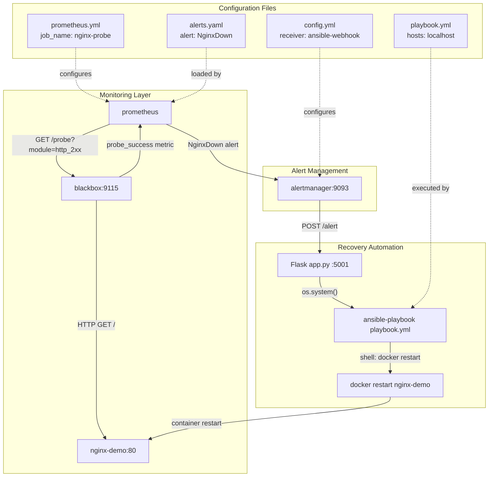
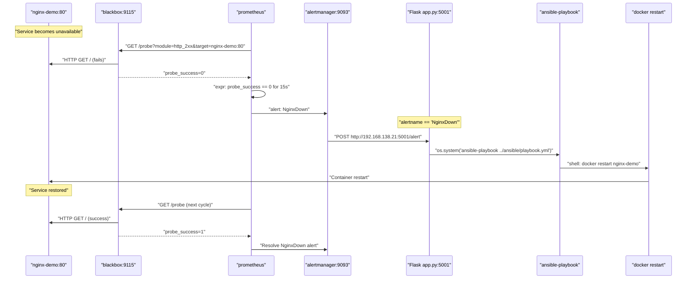

# Self-Healing Infrastructure with Prometheus, Alertmanager & Ansible

A practical DevOps automation project that demonstrates how to detect and recover from service failures automatically using a monitoring and alerting pipeline.

---

## Objective

To build a self-healing system for containerized services (like NGINX) where failures are:

* Monitored using Prometheus and Blackbox Exporter
* Alerted using Alertmanager
* Auto-Recovered by triggering an Ansible playbook via a Flask-based webhook

---

## Tools & Stack

| Tool              | Purpose                              |
| ----------------- | ------------------------------------ |
| Docker            | Container runtime for all services   |
| NGINX             | Target container to monitor          |
| Prometheus        | Monitoring tool + alert rule engine  |
| Alertmanager      | Alert dispatcher                     |
| Blackbox Exporter | Probes HTTP endpoints (health check) |
| Flask (Python)    | Webhook server for Alertmanager      |
| Ansible           | Executes auto-recovery playbook      |

---

## Project Structure

```bash
self-healing-infra/
├── prometheus/
│   ├── prometheus.yml       # Scrape & alert config
│   └── alerts.yml           # Alerting rules
├── alertmanager/
│   └── alertmanager.yml     # Webhook receiver config
├── ansible/
│   └── playbook.yml         # Restart NGINX container
├── app/
│   └── app.py               # Flask webhook receiver
├── Dockerfiles              # For services as needed
└── docker-compose.yml       # Multi-container setup (optional)
```

---

## System Architecture

The following diagram shows the core system architecture with actual code entities and configuration references:



---

## Recovery Flow Process

The following sequence diagram illustrates the complete failure detection and recovery process using actual code entities:



**Flow Summary:**

1. Prometheus + Blackbox Exporter checks NGINX availability.
2. If NGINX is down for 15s, `probe_success == 0` triggers an alert.
3. Alertmanager sends POST request to Flask webhook.
4. Flask receives the alert and triggers an Ansible playbook.
5. Ansible restarts the failed NGINX container.
6. Prometheus verifies the service is back up.

---

## Recovery Conditions

* NGINX container must be named consistently (e.g., `nginx-demo`)
* Flask webhook must be reachable from Alertmanager
* Docker & Ansible installed inside WSL or Linux environment

---

## Sample Alert Rule (alerts.yml)

```yaml
groups:
  - name: nginx-alerts
    rules:
      - alert: NginxDown
        expr: probe_success == 0
        for: 15s
        labels:
          severity: critical
        annotations:
          summary: "NGINX is down"
          description: "Nginx is not responding for 15s"
```

---

## Sample Flask Webhook (app.py)

```python
@app.route('/alert', methods=['POST'])
def alert_receiver():
    data = request.get_json()
    if "alerts" in data:
        for alert in data["alerts"]:
            if alert["labels"].get("alertname") == "NginxDown":
                os.system("ansible-playbook ../ansible/playbook.yml")
```

---

## Result Validation

* Stop NGINX container manually
* Check Prometheus shows `probe_success = 0`
* Confirm Alertmanager fires alert
* Check Flask logs for webhook receipt
* Watch Ansible restart the container

---


## Key Learnings

* Prometheus alert rules and exporters
* Alertmanager webhook routing
* Flask + Python for alert handling
* Ansible automation for container recovery
* Real-time container health monitoring


